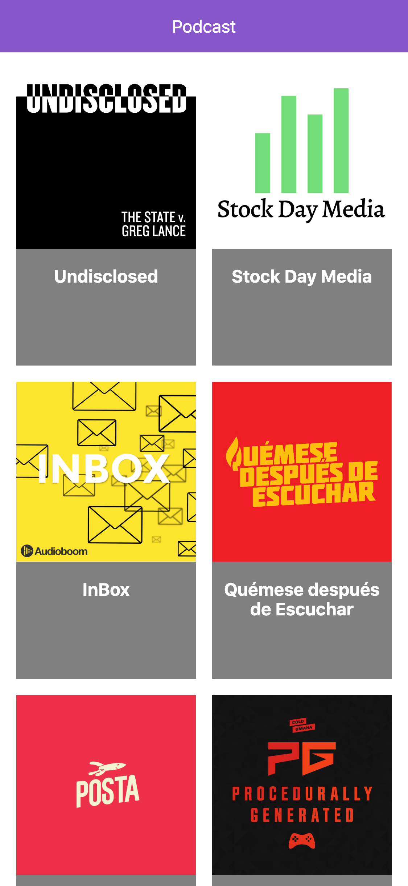

# App de podcast de platzi

App de podcast integrada con la API de audioBoom utilizando NEXT.JS

[Ver la aplicacion](https://podcast-roan-phi.now.sh)

## ¿Cómo funciona?

Requiere Node.js 9 o mayor

* `npm install` para instalar las dependencias.
* `npm run dev` para correr en producción.
* `npm run build && npm start` para correr el entorno de producción.

## Licencia

MIT
